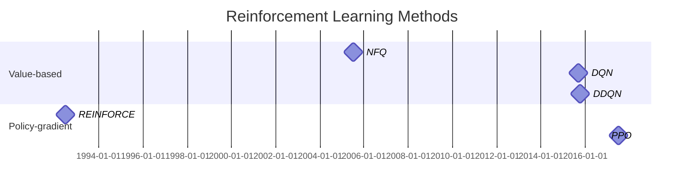

# Model-free RL methods

|                   | on/off | bootstrap | over-estimate |
| ----------------- | ------ | --------- | ------------- |
| MC                | on     | X         | X             |
| SARSA             | on     | O         | X             |
| Q-learning        | off    | O         | O             |
| double Q-learning | off    | O         | less          |
